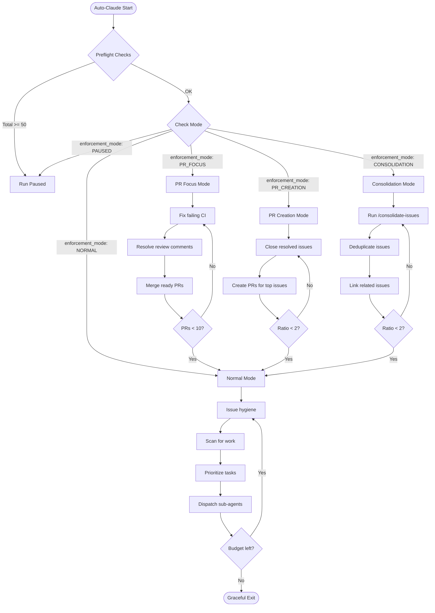
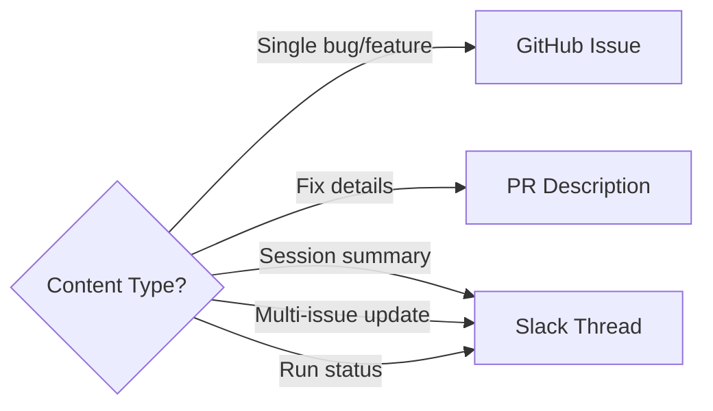

# Auto-Claude Workflow

Visual representation of auto-claude's decision process.

## Main Flow

## Content Routing

## Enforcement Modes

| Mode | Trigger | Behavior |
|------|---------|----------|
| NORMAL | All limits OK | Work normally on all task types |
| CONSOLIDATION | AI-created >= 25 or (ratio > 3 and PRs < 5) | Focus on reducing issue count before new work |
| PR_CREATION | Ratio > 5, PRs < 3 | Skip issues, create PRs to fix existing issues |
| PR_FOCUS | Open PRs >= 10 | Resolve PRs only, no new work |
| PAUSED | Total issues >= 50 | Run skipped entirely |

## Limits

- **50 total issues**: Hard limit - run paused
- **25 AI-created issues**: Soft limit - skip issue creation
- **10 open PRs**: Triggers PR_FOCUS mode
- **3:1 ratio with < 5 PRs**: Triggers CONSOLIDATION mode
- **5:1 ratio with < 3 PRs**: Triggers PR_CREATION mode
